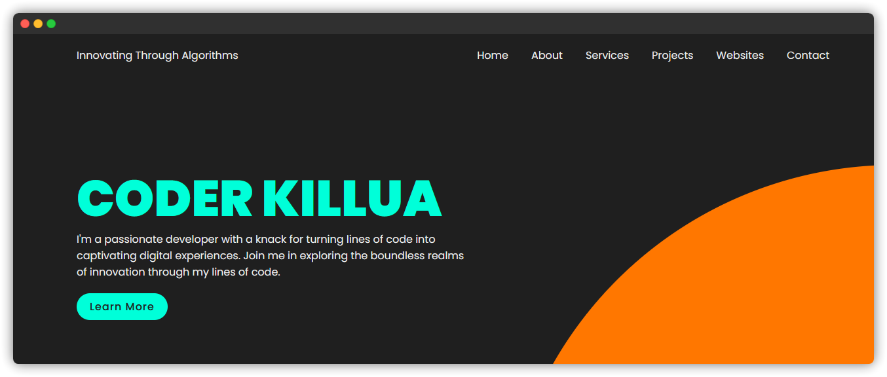

# Coder Killua Website Template



This is a simple website template designed for developers to showcase their skills, projects, and contact information. The template is built using HTML, CSS, and JavaScript.

## Table of Contents

- [Demo](#demo)
- [Features](#features)
- [Usage](#usage)
- [Customization](#customization)
- [License](#license)

## Demo

Check out the live demo of the template: [Coder Killua Website Template](https://killuacoder.netlify.app/)

## Features

- Responsive design suitable for various devices.
- Smooth scrolling navigation using JavaScript.
- Mobile-friendly menu toggle for smaller screens.
- Section-based layout for easy content organization.
- Stylish project and social media buttons.
- Easy-to-customize styles using CSS.

## Usage

1. Clone the repository to your local machine:

   ```
   git clone https://github.com/killuazoldyckreal/html-website-template.git
   ```

2. Open the `index.html` file in your preferred web browser to view the template.

3. Modify the content in the `index.html` file to personalize it with your own information.

4. Customize the colors, fonts, and other styles by editing the `style.css` file.

5. Add or remove sections as needed to fit your content.

6. Update the images and URLs to showcase your own projects and social media profiles.

## Customization

You can easily customize the template by modifying the following files:

- `index.html`: Edit the content and structure of different sections.
- `style.css`: Adjust the styles, colors, fonts, and layout.
- `script.js`: Modify the interactivity and scrolling behavior.

## License

This template is licensed under the [MIT License](LICENSE).
Feel free to use, modify, and distribute it for your personal or commercial projects.

---

If you find this template helpful, consider giving it a ⭐️ on [GitHub](https://github.com/killuazoldyckreal/html-website-template).
For any questions or issues, please open an [issue](https://github.com/killuazoldyckreal/html-website-template/issues).
